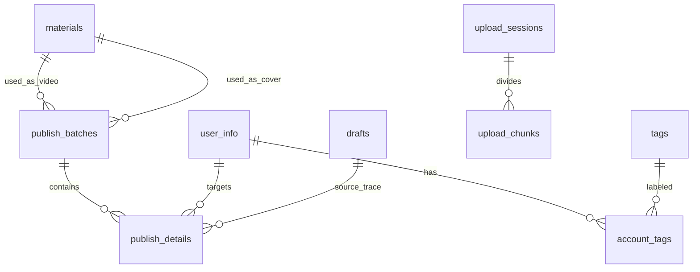

# 五、数据流与关键链路

## 5.1 视频发布主链路（SubmitFlow）

```
[前端 PublishCenter.vue]
    │  用户选择视频素材（material_id）
    │  勾选账号（多选，可按标签过滤）
    │  配置各平台表单（标题/描述/标签/封面/声明/定时）
    ▼
[前端 api/v2.js]  POST /api/v2/publish
    │  请求体: {
    │    type: 'video',
    │    title, description,
    │    video_material_id,
    │    landscape_cover_material_id, portrait_cover_material_id,
    │    accounts: [{ account_id, platform, configs }],
    │    schedule_time?
    │  }
    ▼
[后端 ext_api.__init__]
    │  1. 校验平台/账号可用性
    │  2. INSERT publish_batches (status=pending, account_count=n)
    │  3. 每账号 INSERT publish_details
    │  4. 构建 PublishTask 加入 TaskQueue
    ▼
[后端 TaskQueue worker]
    │  1. 状态 → running
    │  2. 构建 payload = { **account_configs, title, tags, ... }
    │  3. platform = get_platform(platform_type)
    │  4. result = await platform.publish_video(**payload)
    │  5. 成功 → publish_details.status=success, publish_url=结果URL
    │     失败 → status=failed, error_message=异常信息
    │  6. 聚合 batch 状态（success/failed/partial/running）
    ▼
[后端 SSE] 推送 status 变更事件 → 前端任务中心/发布历史实时刷新
```

## 5.2 登录链路

```
[前端 AccountManagement.vue]
    │  点击「扫码登录」→ POST /login/{platform_key}
    ▼
[后端 app.py / blueprints]
    │  1. 创建 SSE 状态队列（active_queues[account_id]）
    │  2. platform.login(id, status_queue) 启动异步登录
    │     - 有头浏览器打开登录页
    │     - 用户扫码
    │     - 等待登录成功 → 保存 cookie → 写数据库
    │  3. 每步状态通过 status_queue → SSE 推送给前端
    ▼
[前端 LoginDialog.vue]  EventSource 实时显示登录进度
```

## 5.3 素材上传链路

```
[前端 MaterialUploader.vue]
    │  选择文件（视频/图片）
    ▼
[前端] POST /api/materials/upload（小文件）
       或 POST /api/materials/chunk/start + chunk/upload（大文件分片）
    ▼
[后端 materials_bp.py]
    │  1. 保存文件到 storage（Local/S3）
    │  2. INSERT materials 记录
    │  3. 异步任务：_generate_video_thumbnail（ffmpeg 抽帧）
    │  4. 异步任务：get_video_duration_safe（时长识别）
    │  5. 返回 material_id
    ▼
[前端] 刷新素材列表，获取缩略图/时长展示
```

## 5.4 定时发布链路

```
[前端 批量设置面板]
    │  选择定时方式：全量统一时间 / 增量递增间隔
    │  配置 enableTimer + scheduleTime
    ▼
[后端 ext_api]
    │  publish_batches.schedule_time 存储
    │  payload: enableTimer, scheduleTime 透传到平台
    ▼
[平台自动化]
    │  各平台实现自己的定时逻辑
    │  （部分平台支持平台内定时，部分需要依赖本地）
```

## 5.5 数据模型关系



## 5.6 关键 API 汇总

| 方法 | 路径 | 说明 |
|------|------|------|
| GET | /getAccounts | 账号列表（含标签） |
| GET | /getValidAccounts | 校验所有账号 cookie 有效性 |
| GET | /deleteAccount?id= | 删除账号 |
| POST | /updateUserinfo | 更新账号信息 |
| GET | /api/tags | 标签列表 |
| POST | /api/tags | 创建标签 |
| POST | /upload | 文件上传 |
| POST | /postVideo | 发布视频（同步） |
| POST | /postVideoBatch | 批量发布视频 |
| POST | /api/v2/publish | 发布（新异步引擎，入口） |
| GET | /api/v2/tasks | 任务列表 |
| GET | /api/v2/tasks/{id} | 任务详情 |
| GET | /api/v2/batches | 发布批次列表 |
| GET | /api/v2/batches/{id} | 批次详情 |
| DELETE | /api/v2/batches/{id} | 删除批次 |
| GET | /api/v2/events | SSE 事件流 |
| GET | /api/v2/stats | 统计数据 |
| GET | /api/v2/accounts | 账号列表 |
| POST | /api/v2/publish/batch-publish | 草稿批量发布 |
| POST | /api/v2/drafts | 创建草稿 |
| GET | /api/v2/drafts | 草稿列表 |
| DELETE | /api/v2/drafts | 批量删除草稿 |
| GET | /api/materials | 素材列表 |
| POST | /api/materials/upload | 上传素材 |
| POST | /api/materials/chunk/start | 分片上传-开始 |
| POST | /api/materials/chunk/upload | 分片上传-上传块 |
| POST | /api/materials/chunk/merge | 分片上传-合并 |
| GET | /api/materials/file/* | 素材文件访问（serve） |
| POST | /api/image-publish | 图集发布 |
| POST | /login/{platform_key} | 扫码登录（SSE） |
| POST | /importAccount | cookie 字符串导入账号 |
| POST | /syncProfile | 同步用户资料 |
| GET | /checkAccount | 检查账号有效性 |
